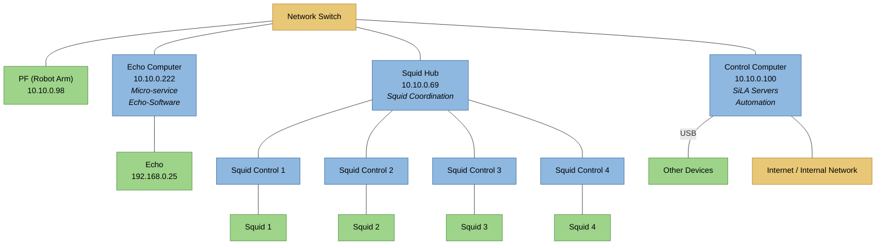
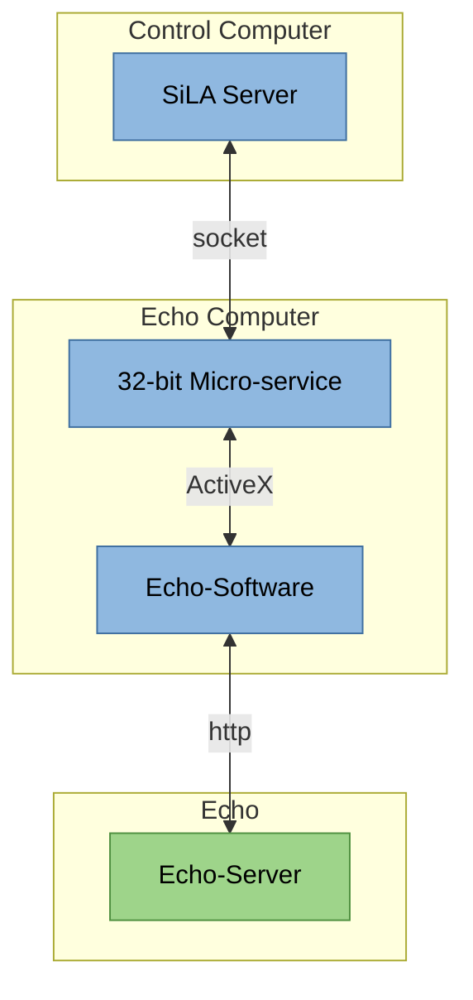

# Connection Setup

This document describes how the computers and devices of the Cage2 platform are
physically connected via the network switch.

## Network Overview

## Echo Automation

The Echo is driven through a chain of software components spread across three
hosts. The 32-bit micro-service bridges the modern SiLA stack to the legacy
Echo software.

## Power Supply

The platform is powered through five separate power supplies. Each supply feeds a
distinct group of devices:

| Power Supply 1   | Power Supply 2 | Power Supply 3 | Power Supply 4 | Power Supply 5 |
| ---------------- | -------------- | -------------- | -------------- | -------------- |
| Control Computer | Squid Hub      | 405 TS         | Sealer         | Echo           |
| Switch           | Squid Controls | BlueWasher     | Cytomats       | Echo-Computer  |
| Screen           | Squids         | MultiFlowFX    | Fridge         |                |
| Robot            |                |                |                |                |
